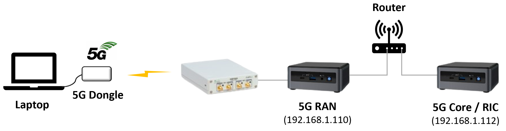

<h1 align="center">SD-RAN 5G Hardware Installation</h1>

## 1. Overall Connectivity



For the SD-RAN 5G scenario, we should have two servers (NUCs), one USRP, and one UE equipped with a 5G dongle. The above fi gure shows the overall connectivity for the scenario. Each NUC has an IP address and they are connected with a L3 router with NAT functionality. In this document, we are assuming that the NUC for 5G RAN has a machine IP address 192.168.1.110. The 5G RAN is based on Open Air Interface (OAI) source code. The NUC for 5G Core / RIC has a machine IP address 192.168.1.112. We use Aether OnRamp to deploy the 5G Core and RIC as Kubernetes-based microservices. The NUC for 5G RAN is connected with the USRP B210 device with USB 3.0 cable. The USRP B210 should be connected to a 5G Sub-6GHz antenna.

## 2. Requirements

- **USRP B210**

- **NUC for 5G RAN (OAI)**
  - CPU: > 6 cores, Intel CPU, Broadwell or later microarchitecture
  - RAM: > 32 GB
  - Disk: > 100 GB
  - OS: Ubuntu 18.04 Server

- **NUC for 5G Core / RIC (Aether OnRamp)**
  - CPU: > 10 cores, Intel CPU, Broadwell or later microarchitecture
  - RAM: > 64 GB
  - Disk: > 100 GB
  - OS: Ubuntu 22.04 Server

- **UE**
  - 5G dongle and connected laptop

- **SIM card**
  - PLMN ID: 00101


## 3. NUC Configuration

### 3.1 NUC for OAI

We will confi gure the NUC for OAI. Before we start, we should make sure that the USRP B210 is NOT connected with the NUC. Otherwise, the NUC will be in trouble while booting up. When we boot up the NUC, we should enter the bios confi guration and then change some parameters:

- Disable secure booting
- Disable hyperthreading
- Enable virtualization (VT-d, etc.)
- Disable all power management functions (C-/P-state related)
- Enable real-time tuning
- Enable Intel Turbo Boost

After the Bios confi guration, we should install Ubuntu 18.04 server and set our Linux user as an administrator.

Then, we should update the Linux kernel, install some tools, and change some confi guration parameters. First of all, we should install Linux low-latency kernel image with the below command:
```bash
sudo apt install linux-image-lowlatency linux-headers-lowlatency
```

Second, we should configure the power management and CPU frequency parameters. Go to */etc/default/grub* file and change the `GRUB_CMDLINE_LINUX_DEFAULT` line as below:
```ini
GRUB_CMDLINE_LINUX_DEFAULT="quiet intel_pstate=disable processor.max_cstate=1 intel_idle.max_cstate=0 idle=poll"
```

After saving it, we should run the below command:
```bash
$ sudo update-grub2
```

Once it was done successfully, go to */etc/modprobe.d/blacklist.conf* file and append below at the end of the file:

```conf
# for OAI
blacklist intel_powerclamp
```

After saving the file, reboot the machine. When the NUC is up again, we should install `cpufrequtils` tool with the below command:

```bash
$ sudo apt-get install cpufrequtils
```

Then, create or open */etc/default/cpufrequtils* file and write below:
```ini
GOVERNOR="performance"
```

Finally, we should run below commands:
```bash
$ sudo systemctl disable ondemand.service
$ sudo /etc/init.d/cpufrequtils restart
```

Then, reboot the NUC one more time.

If we want to verify that the NUC is configured well, we can leverage the `i7z` tool. Install this tool and run it with the below command:
```bash
$ sudo apt install i7z 
$ sudo i7z 
True Frequency (without accounting Turbo) 1607 MHz 
    CPU Multiplier 16x || Bus clock frequency (BCLK) 100.44 MHz 
Socket [0] - [physical cores=6, logical cores=6, max online cores ever=6]
    TURBO ENABLED on 6 Cores, Hyper Threading OFF
    Max Frequency without considering Turbo 1707.44 MHz (100.44 x [17])
    Max TURBO Multiplier (if Enabled) with 1/2/3/4/5/6 Cores is
47x/47x/41x/41x/39x/39x
    Real Current Frequency 3058.82 MHz [100.44 x 30.45] (Max of below)
     Core [core-id] :Actual Freq (Mult.) C0% Halt(C1)% C3% C6% Temp VCore
    Core 1   [0]    :3058.81    (30.45x) 100     0      0   0   64  0.9698 
    Core 2   [1]    :3058.82    (30.45x) 100     0      0   0   63  0.9698 
    Core 3   [2]    :3058.82    (30.45x) 100     0      0   0   64  0.9698 
    Core 4   [3]    :3058.81    (30.45x) 100     0      0   0   64  0.9698 
    Core 5   [4]    :3058.81    (30.45x) 100     0      0   0   65  0.9698 
    Core 6   [5]    :3058.82    (30.45x) 100     0      0   0   62  0.9686
```

If we can see that all cores have **C0%** as **100** and **Halt(C1)%** as **0**, everything is good.

## 3.2 NUC for SD-Core and RIC
The NUC for SD-Core and RIC is good to go if it runs with Ubuntu 22.04 server.

## 4. 5G Core and RIC deployment

After setting up all the NUCs, we will then deploy the 5G Core (from SD-Core project)  and near-real time RIC (from SD-RAN project) using **Aether OnRamp**. For detailed deployment steps, please refer to the Aether OnRamp documentation up to the **Install SD-Core** section (https://docs.aetherproject.org/onramp/start.html) and the **SD-RAN (RIC)** section (https://docs.aetherproject.org/onramp/blueprints.html). You may also refer to the latter part of the SD-RAN 1.5 Techinar video (https://www.youtube.com/watch?v=IiyyBCnqsZw&t=1150s).

After completing these steps, there are additional modifications required in *main.yml*. For hardware installation, *sdcore-5g-values.yaml* should be changed to *radio-5g-values.yaml*. Set `ran_subnet` to an empty string and the `amf: ip` must also be set to the 5G Core/RIC machine IP address (192.168.1.112 in our example). The key changes in *main.yml* are shown below:

```yaml
core:
  standalone: true
  data_iface: eno1 # replace eno1 with the device interface for your server
  values_file: "deps/5gc/roles/core/templates/radio-5g-values.yaml"
  pan_subnet: ""
  ...
amf:
  ip: "192.168.1.112"
```

Network parameters in *radio-5g-values.yaml* (including PLMN ID, OPC, key, DNS settings, etc.) can be configured based on your deployment requirements. An example configuration is attached in **Appendix A**. The USIM of the connected UE must be configured with the corresponding values.


Next, add `net.ipv4.ip_forward=1` to `"/etc/sysctl.conf"` file and apply the changes using the `sysctl -p` command.


After that, configure the following forward rule in iptables for the network interface:
```bash
$ sudo iptables -A FORWARD -i eno1 -o access -j ACCEPT
$ sudo iptables -A FORWARD -i access -o eno1 -j ACCEPT
$ sudo iptables -A FORWARD -i core -o eno1 -j ACCEPT
$ sudo iptables -t nat -A POSTROUTING -o eno1 -j MASQUERADE
```

Next, enter the following commands to set the MTU for the network interfaces:
```bash
$ ifconfig eno1 mtu 1550 up
$ ifconfig access mtu 1550 up
$ ifconfig core mtu 1550 up
```

Last, we should configure the UPF pod to enable privileged mode and adjusting the MTU settings for the network interfaces.:
```bash
$ kubectl edit -n aether-5gc statefulsets upf
# Edit the UPF statefulSet yaml
securityContext
  privileged: true

$ kubectl -n aether-5gc exec -it upf-0 -c bessd -- bash
$ ip l set mtu 1550 dev access
$ ip l set mtu 1550 dev core
```

## 5. OAI 5G RAN Build and Run

Once SD-Core and RIC are ready, we should build and run OAI 5G RAN. After booting this NUC up, now connect the USRP B210 board to the USB 3.0 port. After that, run the below commands to install USRP driver and push UHD image into USRP B210 board:

## USRP Installation
```bash
$ sudo apt-get install libuhd-dev libuhd003 uhd-host
$ sudo uhd_images_downloader
$ uhd_usrp_probe # have to see some outputs - USRP B210 information
```

Note that if "*libuhd003*" makes some errors, we can replace it with "*libuhd003.010.003*".


Then, we should build OAI 5G RAN. We should clone the "*openairinterface5g*" code and then build it with the below commands:
```bash
$ git clone -b 2022.w51-pronto --recurse-submodules \
  https://github.com/onosproject/openairinterface5g.git
$ cd openairinterfae5g/openairinterfae5g
$ source oaienv
$ cd cmake_targets/
$ sudo ./build_oai -w USRP --gNB -I --build-ric-agent
```

If there is no error message, OAI 5G RAN build is successfully done.

And then, run the below commands to add some routing rules and disable TX/RX checksum and GRO:
```bash
$ sudo ethtool -K eno1 tx off rx off gro off gso off
$ sudo route add -net 192.168.250.0/24 gw 192.168.1.108 dev eno1
$ sudo route add -net 192.168.252.0/24 gw 192.168.1.108 dev eno1
```

After that, we should prepare 5G RAN configuration files. **Appendix B** has a RAN configuration file, copy those files to the NUC for the OAI 5G RAN.

Once those configurations are done and the configuration file for 5G RAN is ready, we can run 5G RAN now.
```bash
$ cd cmake_targets/ran_build/build
$ sudo ./nr-softmodem -O /path/to/5GRAN.conf --sa -E --continuous-tx
```

Note: write the correct path for *5GRAN.conf* according to your environment.


## 6. Test and Verification

For the test, we can use a 5G dongle and the laptop to which it is connected. If the dongle has the right SIM card and its configuration matches the parameters in "*radio-5g-values.yaml*", we can start testing it. For the attachment test, we can toggle on and off the airplane mode. We can also verify it by capturing packets with tcpdump on the NUC for 5G Core/RIC. If we can see correct S1AP message exchanges, the 5G dongle is successfully attached. And for the user plane test, we can easily access internet websites from the laptop.

## Appendix A. radio-5g-values.yaml file

```yaml
# SPDX-FileCopyrightText: 2022-present Intel Corporation
# Copyright 2019-present Open Networking Foundation
#
# SPDX-License-Identifier: Apache-2.0

# Disable 4G Control Plane
omec-control-plane:
  enable4G: false

# Disable 5G RAN Simulator
5g-ran-sim:
  enable: false

# Override values for 5g-control-plane Helm Chart
# https://github.com/omec-project/sdcore-helm-charts/blob/main/5g-control-plane/values.yaml
5g-control-plane:
  enable5G: true
  nodeSelectors:
    enabled: false
  # refer to above Helm Chart to add other NF images
  # images:
  #   repository: ""
  #   tags:
  #     amf: <amf image tag>

  kafka:
    deploy: true
    # Enable nodeSelector if needed to control where to deploy the kafka instance(s)
    # controller:
    #   nodeSelector:
    #     node-role.aetherproject.org/5gc: "true"

  mongodb:
    usePassword: false
    persistence:
      enabled: false
    architecture: replicaset
    replicaCount: 2
    # Enable nodeSelector if needed to control where to deploy the mongodb instances
    # nodeSelector:
    #   node-role.aetherproject.org/5gc: "true"
    # arbiter:
    #   nodeSelector:
    #     node-role.aetherproject.org/5gc: "true"

  resources:
    enabled: false

  config:
    # logger:
    #   Util:
    #     debugLevel: warn
    #   AMF:
    #     debugLevel: debug
    #   SMF:
    #     debugLevel: debug

    mongodb:
      name: aether
      url: mongodb://mongodb-headless:27017/?replicaSet=rs0 # note that architecture: replicaset
      authKeysDbName: authentication
      authUrl: mongodb://mongodb-headless:27017/?replicaSet=rs0 # note that architecture: replicaset

    managedByConfigPod:
      enabled: true

    sctplb:
      deploy: false # If enabled then deploy sctp pod
      ngapp:
        externalIp: {{ core.amf.ip }}
        port: 38412

    upfadapter:
      deploy: false # If enabled then deploy upf adapter pod

    metricfunc:
      deploy: true
      cfgFiles:
        metricscfg.yaml:
          configuration:
            controllerFlag: {{ core.closed_loop | default('false') }}
            userAppApiServer:
              addr: "upf"

    # Change AMF config here if rquired
    # Most of the AMF config comes from Slice APIs but some of the config is
    # directly provided through Helm Charts
    amf:
      ngapp:
        externalIp: {{ core.amf.ip }}
      cfgFiles:
        amfcfg.yaml:
          configuration:
            enableDBStore: true # Store AMF subscribers in the datastore
            networkFeatureSupport5GS: # 5gs Network Feature Support IE, refer to TS 24.501 sec. 9.11.3.5
              imsVoPS: 1 # IMS voice over PS session indicator (uinteger, range: 0~1)
            # security:
            #   integrityOrder:
            #     - NIA3
            #     - NIA2
            #     - NIA0
            #   cipheringOrder:
            #     - NEA3
            #     - NEA2
            #     - NEA0

    # SMF config override. Refer to Helm Charts values for more options
    smf:
      cfgFiles:
        smfcfg.yaml:
          configuration:
            enableDBStore: true  # Store SMF subscribers in the datastore
            # staticIpInfo:
            #   - dnn: internet
            #     imsiIpInfo:
            #       imsi-001010123456864: "172.250.0.100"
            #       imsi-001010123456865: "172.250.0.101"

    #pcf:
    #  cfgFiles:
    #    pcfcfg.yaml:
    #      configuration:

    nrf:
      cfgFiles:
        nrfcfg.yaml:
          configuration:
            mongoDBStreamEnable: false    # enable/disable MongoDB stream in NRF
            nfProfileExpiryEnable: true   # If enabled, remove NF profile if no keepalive received
            nfKeepAliveTime: 60           # default timeout for NF profiles

    webui:
      cfgFiles:
        webuicfg.yaml:
          configuration:
            managedByConfigPod:
              enabled: {{ not core.standalone }}
              syncUrl: http://roc-sdcore-adapter-v2-1.aether-roc.svc:8080/synchronize

# Override values for omec-sub-provision (subscriber) Helm Chart
# https://github.com/omec-project/sdcore-helm-charts/blob/main/omec-sub-provision/values.yaml
# ***Note: Most of these values can (and should) be set via ROC API***
omec-sub-provision:
  enable: true
  nodeSelectors:
    enabled: false
  # images:
  #   repository: ""
  #   tags:
  #     simapp: #add simapp override image

  config:
    simapp:
      cfgFiles:
        simapp.yaml:
          configuration:
            provision-network-slice: {{ core.standalone | string }} # if enabled, Device Groups & Slices configure by simapp
            sub-provision-endpt:
              addr: webui  # subscriber configuation endpoint.
            # sub-proxy-endpt: # used if subscriber proxy is enabled in the ROC.
            #   addr: subscriber-proxy.aether-roc.svc.cluster.local
            #   port: 5000

            # Configure Subscriber IMSIs and their security details.
            # You can have any number of subscriber ranges
            # This block is always necessary to establish range(s) of valid IMSIs
            subscribers:
            - ueId-start: "001010100007487"
              ueId-end: "001010100007500"
              plmnId: "00101"
              opc: "981d464c7c52eb6e5036234984ad0bcf"
              op: ""
              key: "5122250214c33e723a5dd523fc145fc0"
              sequenceNumber: "16f3b3f70fc2"

            # Configure Device Groups (ignored if provision-network-slice is disabled)
            device-groups:
            - name:  "user-group1"
              imsis:
                - "001010100007487"
                - "001010100007488"
                - "001010100007489"
                - "001010100007490"
                - "001010100007491"
              msisdns:
                - "msisdn-9000000001"
                - "msisdn-9000000002"
                - "msisdn-9000000003"
                - "msisdn-9000000004"
                - "msisdn-9000000005"
              ip-domain-name: "pool1"
              ip-domains:
                - dnn: internet
                  dns-primary: "163.180.96.54"        # Value is sent to UE
                  mtu: 1460                     # Value is sent to UE when PDU Session Established
                  ue-ip-pool: {{ core.upf.default_upf.ue_ip_pool }}  # IP address pool for subscribers
                  ue-dnn-qos:
                    dnn-mbr-downlink: 1000      # UE level downlink QoS (Maximum bit rate per UE)
                    dnn-mbr-uplink:   1000      # UE level uplink QoS (Maximum bit rate per UE)
                    bitrate-unit: Mbps          # Unit for above QoS rates
                    traffic-class:              # Default bearer QCI/ARP (not used in 5G)
                      name: "platinum"
                      qci: 9
                      arp: 6
                      pdb: 300
                      pelr: 6
              site-info: "enterprise"
            # UPF allocates IP address if there is only 1 device-group
            # SMF allocates IP address if there is >1 device-group

            # Configure Network Slices (ignored if provision-network-slice is disabled)
            network-slices:
            - name: "default"      # can be any unique slice name
              slice-id:            # must match with slice configured in gNB, UE
                sd: "010203"
                sst: 1
              site-device-group:
              - "user-group1"   # All UEs in this device-group are assigned to this slice
              # Applicaiton filters control what each user can access.
              # Default, allow access to all applications
              application-filtering-rules:
              - rule-name: "ALLOW-ALL"
                priority: 250
                action: "permit"
                endpoint: "0.0.0.0/0"
                traffic-class:
                  qci: 9
                  arp: 6
              site-info:
                # Provide gNBs and UPF details and also PLMN for the site
                gNodeBs:
                - name: "gnb1"
                  tac: 1
                - name: "gnb2"
                  tac: 2
                plmn:
                  mcc: "001"
                  mnc: "01"
                site-name: "enterprise"
                upf:
                  upf-name: "upf"  # associated UPF for this slice. One UPF per Slice.
                  upf-port: 8805

# Override values for omec-user-plane Helm Chart
# https://github.com/omec-project/sdcore-helm-charts/blob/main/bess-upf/values.yaml
omec-user-plane:
  enable: true
  nodeSelectors:
    enabled: true
  resources:
    enabled: false
  # images:
  #   repository: ""
  #   tags:
  #     bess: <bess image tag>
  #     pfcpiface: <pfcp image tag>
  #     tools: <aether-pod-init image tag>
  config:
    upf:
      name: "aether-upf"
      sriov:
        enabled: false    # SRIOV is disabled by default
      hugepage:
        enabled: false    # Should be enabled if DPDK is enabled
      routes:
        - to: {{ ansible_default_ipv4.address }}
          via: 169.254.1.1
      enb:
        subnet: {{ ran_subnet }} # Subnet for the gNB network
      access:
        ipam: static
        cniPlugin: macvlan  # Can be any other plugin. Dictates how IP address are assigned
        iface: {{ core.data_iface }}
        gateway: {{ access_gw }}
        ip: {{ access_ip }}
      core:
        ipam: static
        cniPlugin: macvlan  # Can be any other plugin. Dictates how IP address are assigned
        iface: {{ core.data_iface }}
        gateway: {{ core_gw }}
        ip: {{ core_ip }}
      closedLoop: {{ core.closed_loop | default('false') | lower }}
      cfgFiles:
        upf.jsonc:
          mode: {{ core.upf.mode }}
          hwcksum: true
          log_level: "info"
          measure_upf: true
          measure_flow: true
          gtppsc: true                   # Extension header enabled in 5G.
          cpiface:
            dnn: "internet"              # Must match Slice dnn
            hostname: "upf"
            #http_port: "8080"
            enable_ue_ip_alloc: true    # If true, UPF allocates address from following pool
            ue_ip_pool: {{ core.upf.default_upf.ue_ip_pool }} # IP pool used UEs if enable_ue_ip_alloc=true
          slice_rate_limit_config:       # Slice-level rate limiting (also controlled by ROC)
            # Uplink
            n6_bps: 10000000000          # 10Gbps
            n6_burst_bytes: 12500000     # 10ms * 10Gbps
            # Downlink
            n3_bps: 10000000000          # 10Gbps
            n3_burst_bytes: 12500000     # 10ms * 10Gbps
```
## Appendix B. 5GRAN.conf file

```yaml
Active_gNBs = ( "gNB-OAI");
# Asn1_verbosity, choice in: none, info, annoying
Asn1_verbosity = "none";

 gNBs =
(
 {
    ////////// Identification parameters:
    gNB_ID    =  0xe00;
    gNB_name  =  "gNB-OAI";

     RIC : {
       remote_ipv4_addr = "192.168.1.112";
       remote_port = 36401;
       enabled = "yes";
    };

     tracking_area_code  =  1;
    plmn_list = (
      {
        mcc = 001;
        mnc = 01;
        mnc_length = 2;
        snssaiList = (
          {
            sst = 1;
            sd = 0x000001;
          }
        );
      }
    );

     local_s_address = "192.168.1.110";
    nr_cellid = 12345678L;
    do_CSIRS                                                  = 1;
    do_SRS                                                    = 1;

      pdcch_ConfigSIB1 = (
      {
        controlResourceSetZero = 12;
        searchSpaceZero = 0;
      }
    );

     servingCellConfigCommon = (
    {
      physCellId                                                    = 0;
      absoluteFrequencySSB                                          = 641280;
      dl_frequencyBand                                              = 78;
      dl_absoluteFrequencyPointA                                    = 640008;
      dl_offstToCarrier                                           = 0;
      dl_subcarrierSpacing                                        = 1;
      dl_carrierBandwidth                                         = 106;
      initialDLBWPlocationAndBandwidth                            = 28875;
      initialDLBWPsubcarrierSpacing                               = 1;
      initialDLBWPcontrolResourceSetZero                          = 12;
      initialDLBWPsearchSpaceZero                                 = 0;
      ul_frequencyBand                                              = 78;
      ul_offstToCarrier                                             = 0;
      ul_subcarrierSpacing                                          = 1;
      ul_carrierBandwidth                                           = 106;
      pMax                                                          = 20;
      initialULBWPlocationAndBandwidth                            = 28875;
      initialULBWPsubcarrierSpacing                               = 1;
      prach_ConfigurationIndex                                  = 98;
      prach_msg1_FDM                                            = 0;
      prach_msg1_FrequencyStart                                 = 0;
      zeroCorrelationZoneConfig                                 = 13;
      preambleReceivedTargetPower                               = -96;
      preambleTransMax                                          = 6;
      powerRampingStep                                            = 1;
      ra_ResponseWindow                                           = 4;
      ssb_perRACH_OccasionAndCB_PreamblesPerSSB_PR                = 4;
      ssb_perRACH_OccasionAndCB_PreamblesPerSSB                   = 14;
      ra_ContentionResolutionTimer                                = 7;
      rsrp_ThresholdSSB                                           = 19;
      prach_RootSequenceIndex_PR                                  = 2;
      prach_RootSequenceIndex                                     = 1;
      msg1_SubcarrierSpacing                                      = 1,
      restrictedSetConfig                                         = 0,
      msg3_DeltaPreamble                                         = 1;
      p0_NominalWithGrant                                         =-90;
      pucchGroupHopping                                           = 0;
      hoppingId                                                   = 40;
      p0_nominal                                                  = -90;
      ssb_PositionsInBurst_PR                                       = 2;
      ssb_PositionsInBurst_Bitmap                                   = 1;
      ssb_periodicityServingCell                                    = 2;
      dmrs_TypeA_Position                                           = 0;
      subcarrierSpacing                                             = 1;
      referenceSubcarrierSpacing                                    = 1;
      dl_UL_TransmissionPeriodicity                                 = 6;
      nrofDownlinkSlots                                             = 7;
      nrofDownlinkSymbols                                           = 6;
      nrofUplinkSlots                                               = 2;
      nrofUplinkSymbols                                             = 4;
      ssPBCH_BlockPower                                             = -25;
    }
  );

     SCTP :
    {
        SCTP_INSTREAMS  = 2;
        SCTP_OUTSTREAMS = 2;
    };

     amf_ip_address      = ( { ipv4       = "192.168.1.112";
                              ipv6       = "192:168:30::17";
                              active     = "yes";
                              preference = "ipv4";
                            }
                          );


     NETWORK_INTERFACES :
    {
        GNB_INTERFACE_NAME_FOR_NG_AMF            = "demo-oai";
        GNB_IPV4_ADDRESS_FOR_NG_AMF              = "192.168.1.110/24";
        GNB_INTERFACE_NAME_FOR_NGU               = "demo-oai";
        GNB_IPV4_ADDRESS_FOR_NGU                 = "192.168.1.110/24";
        GNB_PORT_FOR_S1U                         = 2152; # Spec 2152
    };

   }
);

 MACRLCs = (
{
  num_cc                      = 1;
  tr_s_preference             = "local_L1";
  tr_n_preference             = "local_RRC";
  pusch_TargetSNRx10          = 200; # 150;
  pucch_TargetSNRx10          = 200;
  ulsch_max_frame_inactivity  = 0;
}
);

 L1s = (
{
  num_cc = 1;
  tr_n_preference       = "local_mac";
  prach_dtx_threshold   = 120;
  pucch0_dtx_threshold  = 100;
  ofdm_offset_divisor   = 8;
}
);

 RUs = (
{
  local_rf       = "yes"
  nb_tx          = 1
  nb_rx          = 1
  att_tx         = 12;
  att_rx         = 12;
  bands          = [78];
  max_pdschReferenceSignalPower = -27;
  max_rxgain                    = 114;
  eNB_instances  = [0];
  bf_weights = [0x00007fff, 0x0000, 0x0000, 0x0000];
  clock_src = "internal";
}
);

 THREAD_STRUCT = (
{
  parallel_config    = "PARALLEL_SINGLE_THREAD";
  worker_config      = "WORKER_ENABLE";
}
);

 rfsimulator :
{
  serveraddr = "server";
  serverport = "4043";
  options = (); #("saviq"); or/and "chanmod"
  modelname = "AWGN";
  IQfile = "/tmp/rfsimulator.iqs";
};

 security = {
  ciphering_algorithms = ( "nea0" );
  integrity_algorithms = ( "nia2", "nia0" );
  drb_ciphering = "yes";
  drb_integrity = "no";
};

 log_config :
{
  global_log_level                      ="info";
  hw_log_level                          ="info";
  phy_log_level                         ="info";
  mac_log_level                         ="info";
  rlc_log_level                         ="info";
  pdcp_log_level                        ="info";
  rrc_log_level                         ="info";
  ngap_log_level                        ="debug";
  f1ap_log_level                        ="debug";
};
```

