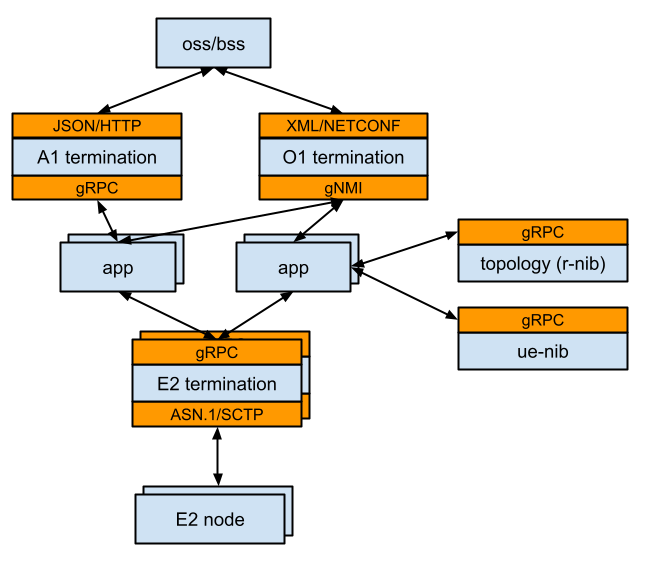

<!--
SPDX-FileCopyrightText: 2019-present Open Networking Foundation <info@opennetworking.org>

SPDX-License-Identifier: Apache-2.0
-->

# Architecture

SD-RAN project is based on the µONOS architecture, which is centered on micro-services and use of gRPC APIs for
inter-process communication. As such, the project relies on several µONOS platform components and libraries,
i.e. `onos-topo`, `onos-config`, `onos-cli`, etc.

The µONOS RIC (RIC for short) follows a similar structure to other µONOS subsystems in that it clearly delineates roles
of its southbound, northbound and core/store components. O-RAN specification portrays the near-RT apps
(xApps) as being part of the overall RIC. This is similar to how apps are placed in the ONOS classic
architecture - as kernel extensions.

The high-level structure of the RIC is depicted in the following schematic:

The RIC system can be thought of as a “chassis”. This chassis includes a number of key subsystems that 
constitute the RIC platform. The near-RT applications can then be installed into this “chassis” and 
will use gRPC-based APIs to interact with the various RIC platform services.

The following are the key RIC platform services and a summary of their roles:
* E2 Termination - handles external ASN.1/SCTP connections to E2 nodes and acts as a relay for applications to receive and send E2SM messages
* A1 Termination - handles external JSON/HTTP REST API requests from northbound orchestration systems and non-real time applications
* O1 Termination - handles external XML(YANG)/NETCONF configuration requests and various operations-related tasks
* E2 Subscription Management - manages subscription requests for E2SM messages and assists in routing of messages between E2 termination nodes and applications
* R-NIB Service - tracks and disseminates information about the E2 nodes and their relationships in the RAN environment
* UE-NIB Service - tracks and disseminates information about the end-nodes (UEs)
* Storage Facilities - facilities for applications to maintain their state in a distributed, scalable and highly-available manner

Each of the above services is (or will be) be implemented as a separate micro-service and each will 
allow running multiple instances to provide for scalability and high-availability. 
The plan is to implement all services in Golang, for consistency with the other µONOS services and 
to take advantage of a number of µONOS patterns and libraries. 
One small exception may be some parts of the E2 termination, which may utilize some C libraries to
assist in transcoding ASN.1 and protobuf messages.

Each of the “termination” services provides an exterior interface to interact with the 
outside environment using the protocols and encodings specified by the O-RAN standards. 
They will also provide an interior gRPC interface for use by the RIC applications.

## SDK
To simplify development of RIC applications and to avoid proliferation of similar code-patterns,
an SDK is provided in form of a library that applications can link with. The role of the SDK is to 
encapsulate some of the complexities of dealing with individual gRPC services and to provide implementation of
client-side logic, which is likely to be shared by many applications. One example of this is
handling individual connections to E2T nodes in order to be able to receive E2 indications.

## Current Components
The initial version of SD-RAN platform instantiates the above elements of the architecture as follows:

* E2 Termination - implemented via `onos-e2t`, tracks E2 node connections and manages subscriptions
* A1 Termination - not implemented yet
* O1 Termination - partially implemented via `onos-config` and gNMI, rather than via NETCONF
* R-NIB Service - implemented by the `onos-topo` subsystem using entity/relation scheme and is extensible using information "aspects"
* UE-NIB Service - implemented by the `onos-uenib` subsystem, supports high read/write rates and is extensible using information "aspects" 
* Storage Facilities - backed by `atomix` and related libraries

