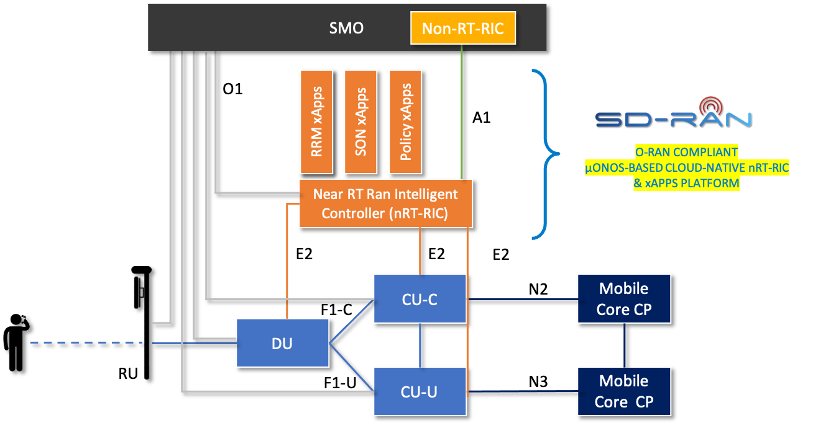
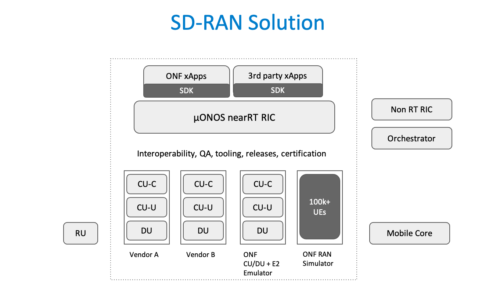

<!--
SPDX-FileCopyrightText: 2019-present Open Networking Foundation <info@opennetworking.org>

SPDX-License-Identifier: Apache-2.0
-->

# Introduction

SD-RAN is ONF's new exemplar platform for 3GPP compliant software-defined RAN
that is consistent with the O-RAN architecture.

Starting with a micro-ONOS based near-Real-Time RAN Intelligent Controller
(RIC), the exemplar platform also aims to develop open source components for
the control and user planes of the Central Unit and the Distributed Unit of the
disaggregated RAN in close coordination with the O-RAN Alliance and O-RAN
Software Community.

The SD-RAN solution involves work in the following areas

* O-RAN compliant interfaces E2, O1, A1 and protocols ASN.1, SCTP, NETCONF etc
* Clustered micro-ONOS architecture for HA and Performance
* Integration with 3rd party xApp vendors
* Develop an SDK that makes xApps portable across RIC implementations
* Integration with 3rd party CU/DU vendors
* Develop ONF’s own O-RAN compliant RU/CU/DU to serve as exemplar
* Develop ONF’s own O-RAN compliant Ran-Simulator for scale testing
* Develop sdRan-in-a-Box (RiaB), a complete e2e solution for dev/test & reference
* Contribute learnings of new SMs and app-sdk back to O-RAN and OSC
* Releases every quarter with regression test suites on physical test-pods
* QA/Interoperability lab with DT O-RAN Open Test and Integration Center (OTIC) in Berlin
* Hardening & operationalization towards Lab & Field-trials with partner operators
